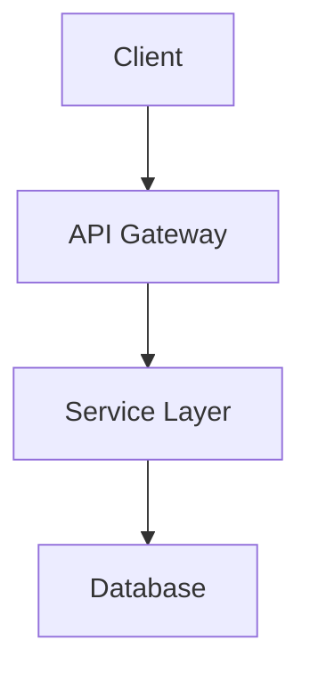

# 

# Project Title

Brief one-line summary of your project.


---

## 📋 Table of Contents

- [Overview](#overview)
- [Installation](#installation)
- [Usage](#usage)
- [Configuration](#configuration)
- [Project Structure](#project-structure)
- [Architecture](#architecture)
- [Contributing](#contributing)
- [License](#license)
- [Acknowledgments](#acknowledgments)

---

## 🧩 Overview

Describe what the project does, its purpose, and core features.
Include screenshots or animated GIFs here for visual clarity.

## 🚀 Installation

List dependencies and commands to install:

```bash
# Python
pip install -r requirements.txt

# Node.js
npm install

# Go
go install ./...

# Rust
cargo build --release
```

## 💻 Usage

Show how to use the project with basic examples:

```bash
python main.py
# or
npm run dev
```

Screenshots, GIFs or terminal recordings encouraged.

## ⚙️ Configuration

List required environment variables and how to set them:

```env
API_KEY=your_api_key_here
DATABASE_URL=your_database_url
```

Reference a `.env.example` file for setup hints.

## 📁 Project Structure

```
project-root/
├── README.md
├── LICENSE
├── .env.example
├── .github/
│   └── workflows/
├── docs/
├── src/ or cmd/ or flaskapp/
├── tests/
├── scripts/
├── assets/
├── config/
├── package.json / go.mod / Cargo.toml / pyproject.toml
├── CONTRIBUTING.md
└── CODE_OF_CONDUCT.md
```

For complex folders, include subfolder README.md files.

## 🔧 Architecture

Visualize your project structure:



Add file trees or component diagrams where helpful.

## 🤝 Contributing

1. Fork the repo
2. Create a branch (`git checkout -b feature/new-feature`)
3. Commit your changes (`git commit -m 'Add new feature'`)
4. Push and open a pull request

See [CONTRIBUTING.md](./CONTRIBUTING.md) for details.

## 📄 License

Distributed under the MIT License. See [LICENSE](./LICENSE) for full details.

## 🙌 Acknowledgments

Mention libraries, contributors, sponsors, or sources of inspiration.

---

> “Your documentation is a direct reflection of your software—hold it to the same standards.”
